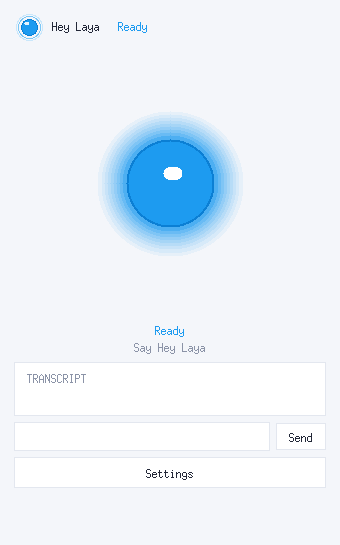
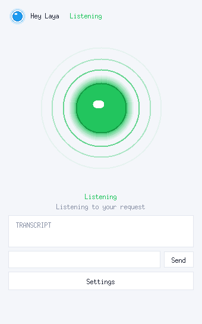
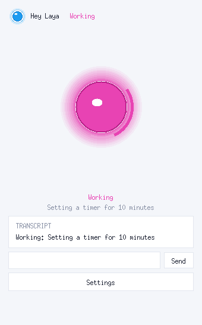
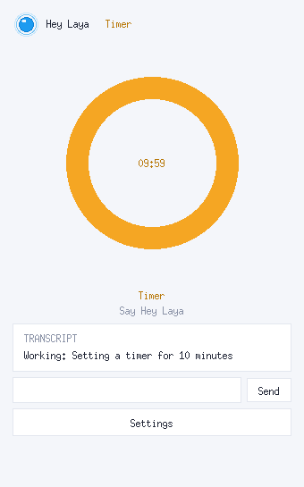
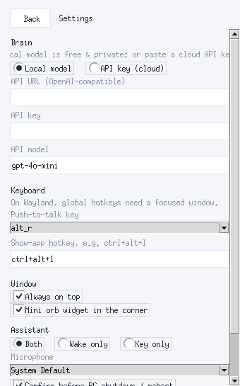

# Hey Laya

**Local-first voice assistant.** Hold a key, say *“Hey Laya”*, or just type —
music, volume, apps, dark mode, timers, and system power, all decided
on-device by the [Laya](https://pypi.org/project/laya/) reasoning model and
spoken back with Kokoro TTS. Zero API keys, zero cloud (unless you paste one
in Settings → Brain).

```
hold Right-Alt → “set volume to fifty percent” → [Laya] volume_set 50 → “Volume set.”
say “Hey Laya, open Spotify”                   → [Laya] app → xdg-open spotify → “Opening it.”
say “Hey Laya, what’s the capital of France”   → [Laya] none → local LLM (or canned fallback)
```

|  |  |  |  |
|:---:|:---:|:---:|:---:|
| Ready | Listening | Working | Timer |

The orb (blue/green/magenta/red + Failed state) breathes, ripples, spins and
blinks; an idle timer takes over as an amber countdown ring, and any spoken
task temporarily borrows the stage, then hands the ring back. A floating
mini-orb, a system tray icon, and a type-to-talk box round out the UI:

|  |  |
|:---:|:---:|
| In-app Settings panel (Brain, Keyboard, Window, Assistant) | Floating mini orb (click toggles, drag moves) |

| Layer | Choice | Why |
|-------|--------|-----|
| Decision | **Laya** in-process (English checkpoint) | open-weights router; calibrated `answer_confidence` gates every command |
| STT | faster-whisper in an **isolated worker process** (`tiny`, CPU int8) | torch + ctranslate2 segfault in one address space — the worker dies alone and respawns; auto-degrades to `tiny` on low RAM |
| TTS | Kokoro-82M (`af_heart`) | offline, 24 kHz, warm disk cache, niced so it never freezes the orb |
| LLM | `LLM_URL` → Settings API key → llama-server → Ollama → canned | only for open questions; **autostart off by default** |
| UI | Tk orb + mini widget + tray | 20fps capped, auto light-mode on slow renderers, main-thread only |
| Actions | `playerctl` / `wpctl` / `gsettings` / `xdg-open` (Linux), pycaw (Windows) | native tools, no agents, no shell exec |

---

## Install

```bash
git clone https://github.com/touhidsiddiqueeraj-bit/hey-laya.git
cd hey-laya
./install.sh
```

`install.sh` is idempotent. It will:

1. Create `.venv` if missing (Python ≥ 3.10)
2. Install `requirements.txt` (uses `uv` if present, else `pip`)
3. Write `.env` from `.env.example` (first run only)
4. Put **`hey-laya`** on your PATH → `~/.local/bin/hey-laya`
5. Add a desktop entry → `~/.local/share/applications/hey-laya.desktop`
6. Run the fast test suite as a smoke check

Manual alternative:

```bash
python3 -m venv .venv && source .venv/bin/activate
pip install -r requirements.txt
cp .env.example .env
python main.py --help
```

---

## Use

```bash
hey-laya                     # full voice: PTT (hold Right-Alt) + wake word
hey-laya --ptt-only          # only push-to-talk
hey-laya --wake-only         # only always-on wake word
hey-laya --text "volume up"  # one utterance, print reply (no mic)
hey-laya --no-ui             # headless (no Tk window)
```

| Flag | Meaning |
|------|---------|
| `--text "…"` | Run one utterance through the full pipeline and print the reply |
| `--fixture FILE` | Batch routing smoke test (no audio) |
| `--gate 0.50` | Laya confidence gate — lower ⇒ more LLM fallback |
| `--stt base` | faster-whisper size: `tiny` / `base` / `small` / `medium` |
| `--demo-tts` | Warm the TTS cache and exit |
| `--no-ui` | Headless |
| `--ptt-only` / `--wake-only` | Restrict interaction mode |

### Interaction

- **Push-to-talk:** hold **Right-Alt** (or hold the orb / Space while the window
  is focused), speak, release. Recording stops → whisper transcribes → Laya
  decides → action runs → Kokoro speaks the reply.
- **Wake word:** always listening (~2.2 s slices, room-noise calibrated). Say
  **“Hey Laya”** — a chime confirms she's listening — then speak the command.
  Slices are no-speech gated and the mic stays shut during replies, so she
  doesn't talk to herself.
- **Type-to-talk:** the text box under the transcript runs the full pipeline
  without any mic — handy in noisy rooms or when the mic misbehaves.
- **UI:** always-on-top orb window (Ready/Listening/Working/Failed + amber
  timer ring), floating mini orb (top-right, click toggles), tray icon with
  Show/Hide/Settings/Quit, and the **Settings** button opens the in-app panel
  (Brain incl. API key, Keyboard incl. show-app hotkey, Window, Assistant) —
  no JSON editing needed.

### What it understands (v1)

| Domain | Examples |
|--------|----------|
| Media | “pause the music”, “next track”, “play” |
| Volume | “volume up”, “mute”, “set volume to fifty percent” |
| Apps | “open Spotify”, “launch the terminal”, “focus Slack” |
| Display | “switch to dark mode”, “brightness up” |
| System | “lock the computer” *(logout/shutdown/reboot/sleep confirmed by wording)* |
| Timers | “set a timer for ten minutes” |
| Anything else | falls through to the local LLM, or a canned “can’t answer” reply |

Intent routing is **not** keyword matching — Laya answers structured questions
(see `decide.py`) and `answer_confidence < GATE` always falls back to the LLM.

---

## Configuration (`.env`)

| Var | Default | Meaning |
|-----|---------|---------|
| `GATE` | `0.50` | Laya confidence gate for acting vs asking the LLM |
| `STT_MODEL` | `base` | faster-whisper size — auto-degraded to `tiny` under ~10 GB free RAM (override with `--stt`) |
| `TTS_VOICE` | `af_heart` | Kokoro voice |
| `KOKORO_PY` | — | Override Kokoro interpreter (defaults to project venv) |
| `MODE` | `both` | `ptt` \| `wake` \| `both` |
| `LLM_URL` | — | Explicit OpenAI-compatible endpoint (skips auto-detect) |
| `LLM_MODEL` | `~/…/Qwen3-4B-Q4_K_M.gguf` | GGUF for llama-server spawn |
| `LLAMA_SERVER_BIN` | — | llama-server binary path (auto-detects if empty) |
| `LLM_AUTOSTART` | **`0`** | `1` spawns llama-server on `:8081` at startup |
| `OLLAMA_MODEL` | `qwen3:4b` | Model name when using Ollama |
| `POLARIS_TTS_URL` | — | Optional external TTS HTTP endpoint |
| `LAYA_DEBUG` | `0` | `1` prints routine wake chatter (triggers, commands) |

### LLM chain (first hit wins)

1. `LLM_URL` if set
2. API key from Settings → Brain (OpenAI-compatible endpoint)
3. Healthy llama-server on `:8080` (e.g. Polaris) or `:8081`
4. Own thin llama-server spawn on `:8081` — **only if `LLM_AUTOSTART=1`**
5. Ollama on `:11434`
6. Canned reply: *“I can't answer that yet — no local model is running.”*

> **RAM warning.** Laya (torch) uses ~4–6 GB. Adding a 4B llama-server on top
> can OOM an 8–16 GB machine. Autostart defaults to **off** for this reason.
> Start a server manually (or use Polaris) when you need open-ended answers,
> and only set `LLM_AUTOSTART=1` if ≥ 8 GB is free.

---

## Architecture

```
mic ─► audio.Recorder ─► STT worker ─► text            (own process, respawns)
     (slices, echo-gated)  stt_worker.py                │
                                           ▼
                               decide.decide(router, text)
                               ┌────────────────────────────┐
                               │ Laya Router.predict()      │
                               │  task → domain questions   │
                               │  answer_confidence ≥ GATE? │
                               └────────────┬───────────────┘
                           actions          │          needs_llm
                               │            └───────────┤
                               ▼                        ▼
                      actions.run(dict)            llm.ask(text)
                      linux | windows            (chain, canned)
                               │                        │
                               └──────────┬─────────────┘
                                          ▼
                               tts.Speaker (queue)
                               cache → Kokoro → play_wav
```

- **`decide.py`** — the Laya question set (dict of `type` / `instructions` /
  `criteria`, dependency-gated) + `split_actions` mapping answers to action
  dicts. A regex hint forces `open|launch|start|run <known-app>` to the app path.
- **`actions/`** — thin, fail-safe platform adapters. Unknown commands return an
  error reply; nothing here executes arbitrary shell.
- **`audio.py` + `stt_worker.py`** — the recorder, fuzzy wake regex, echo
  suppression (half-duplex + post-playback grace), no-speech gating, and the
  isolated whisper worker over JSON lines. Temp slices are deleted after use.
- **`tts.py`** — SHA-256 disk cache of every canned line (warmed at startup);
  live lines render via niced Kokoro subprocesses. Fail loud.
- **`llm.py`** — explicit chain (env → Settings API key → servers → canned),
  short timeouts, Qwen3 `reasoning_content` handling (`_pick_content`).
- **`ui.py` / `tray.py` / `settings.py`** — orb window + floating mini widget +
  tray icon; JSON settings file with an in-app panel (never hand-edit).
- **Stability.** One instance holds the mic (flock singleton — doubles exit).
  Everything logs to `~/.cache/hey-laya/app.log`, and `faulthandler` dumps
  thread stacks there on any fatal signal, so silent native deaths stay
  diagnosable. Thread env (`OMP_*`) is pinned before torch/BLAS load.

### Project layout

```
main.py            entry point: pipeline, PTT/wake loops, CLI, UI wiring
decide.py          Laya QUESTIONS + decide/split_actions   (self-check: python decide.py)
llm.py             backend chain                            (self-check: python llm.py)
tts.py             cache + Kokoro + Polaris                 (self-check: python tts.py)
audio.py           recorder, wake regex, STT client, play   (self-check: python audio.py)
stt_worker.py      isolated faster-whisper process (JSON lines over stdio)
replies.py         canned spoken strings
timers.py          background countdown                     (self-check: python timers.py)
ui.py              orb window + mini widget + settings panel
tray.py            system tray icon (pystray, optional)
settings.py        JSON settings load/save + defaults
actions/           linux.py · windows.py · __init__.py (dispatcher)
fixtures/          routing.txt — batch phrases
docs/img/          UI screenshots (orb states, timer, panel, mini)
test_all.py        full test suite (--full adds live Laya)
install.sh         system installer
```

---

## Test

```bash
source .venv/bin/activate
python test_all.py          # fast: 79 checks, no model load, no mic/display needed
python test_all.py --full   # + live Laya routing fixture (~2 GB RAM)
python main.py --fixture fixtures/routing.txt   # 9-phrase batch through the app
```

CI-friendly: `test_all.py` needs no microphone, no display (UI check degrades
gracefully), and no LLM server.

---

## Troubleshooting

| Symptom | Fix |
|---------|-----|
| `hey-laya: command not found` | `export PATH="$HOME/.local/bin:$PATH"` and reopen the shell |
| No reply voice | Check `python tts.py`; set `KOKORO_PY` to a working Kokoro venv; need a default audio sink |
| PTT does nothing | pynput needs X11/Wayland input access; try `--text` first to isolate |
| Wake never fires | Run `hey-laya --mic-test` (records 3s, prints level + transcription); mic default source? `python -c "import sounddevice as sd; print(sd.query_devices())"`; try `--stt tiny` |
| Wake worked once, then repeats/garbles | Fixed: the wake carryover is now consumed on trigger and the loop re-arms; mic stays shut while a reply plays (half-duplex) |
| Assistant hears its own replies | Echo guard: mic stays shut during playback + 0.6s grace after; slices overlapped by playback start are discarded |
| High CPU while idle | First ~minute is model load + TTS warm (expected). After that, suspects: a noisy mic keeps STT transcribing nonstop — run `hey-laya --mic-test` in a quiet room (level should read ≈0.000) and pick another mic in Settings if not; or a software renderer — `[ui] slow tick …ms` / `[ui] slow renderer detected` lines confirm it, and the UI drops to light animations by itself. |
| App pegged at high CPU, UI frozen, wake dead | A hung inference (STT hallucination loop or giant decision input) used to wedge the worker forever. STT output is now capped, wake slices over ~150 chars are rejected, decision input truncated at 220 chars. Also: only one instance can hold the mic now — a second launch exits naming the holder pid. |
| Assistant speaks unprompted ("talks to herself") | Wake slices are no-speech gated and the mic stays shut during replies. Usual cause is TV/music/dialogue near the mic. Run with `LAYA_DEBUG=1` to see what triggered each turn. |
| Mini widget shows a box, not a floating orb | Tk can only cut a 1-bit shape mask on X11 — no per-pixel alpha. The glow edges now snap exactly to the key color so no smudge survives either way. Toggle it off in Settings → Window. |
| Terminal too chatty / too quiet | Routine wake lines print only with `LAYA_DEBUG=1`. Errors always print. |
| No tray icon | Optional deps: `pip install pystray pillow python-xlib` (X11) — the app runs fine without them |
| Right-Alt PTT never fires | Wayland blocks global hotkeys — use the **Hold-to-talk** button in the Laya window, or Space while it is focused |
| Show-app hotkey does nothing | Same Wayland limit as above; the in-window Space hold-to-talk always works |
| App closes / does nothing after a few seconds | See `~/.cache/hey-laya/app.log` first — fatal signals now dump thread stacks there. Also `journalctl --user -u 'app-hey-laya*' --since -1h`, `coredumpctl list hey-laya`. Known history: torch + ctranslate2 in one process segfault (fixed by isolating STT in `stt_worker.py`); Tk UI must only be touched from the main thread |
| Two instances running / doubled replies / mic busy | Only one instance can hold the mic — a second launch exits naming the holder pid. Kill stale ones by pid. |
| Disk filling up (/tmp full, crashes) | Mic slices clean up after themselves; a startup sweep clears orphans. Old systemd coredumps under `/var/lib/systemd/coredump/` may need sudo to clear. |
| “can't answer” on questions | Expected with `LLM_AUTOSTART=0`. Start llama-server/Ollama, set `LLM_URL`, or open Settings (button below the orb) → Brain → API key |
| OOM / machine freezes | Keep `LLM_AUTOSTART=0`; use `--stt tiny`; close other heavy apps |
| LLM answers only reasoning | Handled automatically (`_pick_content` + retry); still empty ⇒ raise `max_tokens` in `llm.py` |
| `laya` checkpoint temp warning | Upstream known issue; confidence for 11+ choice labels is uncalibrated — our question sets stay under that |
| Windows: no volume control | `pip install pycaw comtypes` on the Windows Python |

---

## Platform notes

**Linux (primary, tested):** PipeWire/Pulse (`wpctl`/`pactl`), playerctl for
media, `brightnessctl` → `gsettings` → `xrandr` chain for brightness, GNOME/KDE
dark mode via `gsettings`, `loginctl` lock.

**Windows (secondary):** pycaw volume, `os.startfile` apps, SendInput media
keys, registry dark mode. Python 3.11 + `pip install pycaw comtypes`. Right-Alt
PTT works via pynput; wake word needs a default mic.

**Not in v1:** shell exec, file operations, web search, plugins, macOS,
PyInstaller packaging, multi-language Laya.

---

## Development

```bash
source .venv/bin/activate
python test_all.py          # before every commit
python -m pyflakes *.py actions/*.py
```

Each module keeps an assert-based `demo()` under `if __name__ == "__main__"`.
See [CONTRIBUTING.md](CONTRIBUTING.md).

## License

[MIT](LICENSE)
